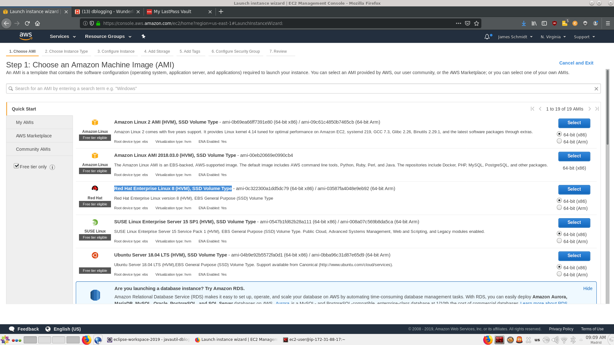
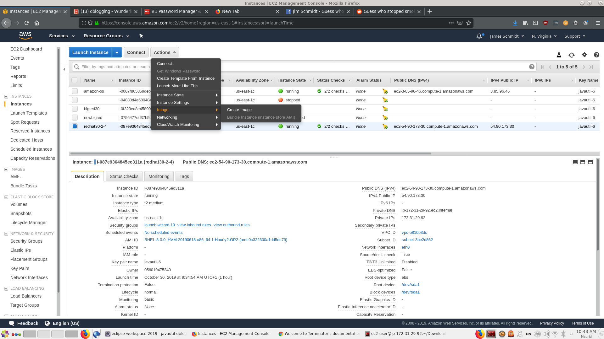

# Creating an Amazon Redhat Instance

# Steps

# ssh

## pem files
You should know have a pem file in ~/.ssh such as *javautil-6.pem*

Permissions must be 600
    chmod 600 ~/.ssh/javautil-6.pem

## config

The first line of your config file should be

   ServerAliveInterval 120

Or your sessions will time out

Each remote host should be specified 

    Host ec2-3-95-139-161.compute-1.amazonaws.com
        IdentityFile ~/.ssh/javautil-6.pem

# .amazon

# set up config on amazon

jjs ~>cd .ssh
jjs ~/.ssh>scp * ec2-user@$amazon:.ssh

# Push the configuration over

brazil setamazon newbigred

    qcd 6
 
    cd amazon-redhat

st set to ec2-54-90-173-30.compute-1.amazonaws.com
jjs ~/.ssh>scp javautil-6.pem ec2-user@$amazon:.ssh
javautil-6.pem                                            100% 1696    14.3KB/s   00:00    
jjs ~/.ssh>scp config ec2-user@$amazon:config
config   

# Images

