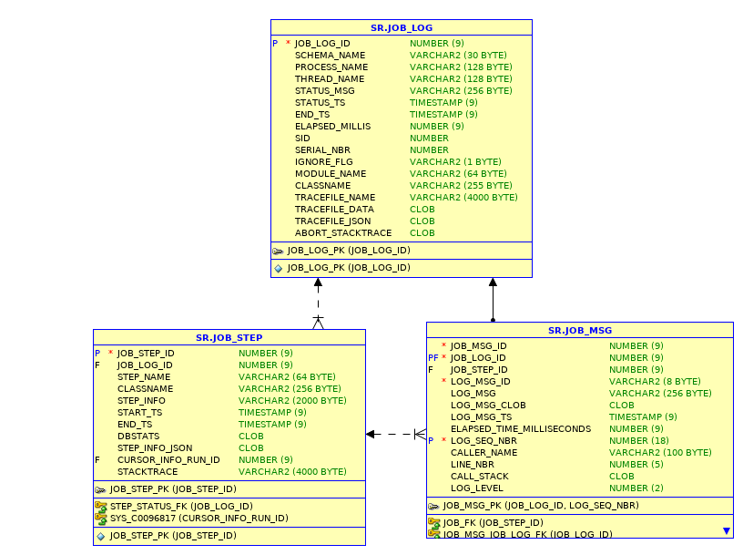

Database Logging 
================ 

included file

job\_tables
~~~~~~~~~~~

In the interest of expediency we have a quick listing of the job tables.

::

    SQL> describe job_log
     Name                                      Null?    Type
     ----------------------------------------- -------- ----------------------------
     JOB_LOG_ID                                NOT NULL NUMBER(9)
     SCHEMA_NAME                                        VARCHAR2(30)
     PROCESS_NAME                                       VARCHAR2(128)
     THREAD_NAME                                        VARCHAR2(128)
     STATUS_MSG                                         VARCHAR2(256)
     STATUS_TS                                          TIMESTAMP(9)
     END_TS                                             TIMESTAMP(9)
     ELAPSED_MILLIS                                     NUMBER(9)
     SID                                                NUMBER
     SERIAL_NBR                                         NUMBER
     IGNORE_FLG                                         VARCHAR2(1)
     MODULE_NAME                                        VARCHAR2(64)
     CLASSNAME                                          VARCHAR2(255)
     TRACEFILE_NAME                                     VARCHAR2(4000)
     TRACEFILE_DATA                                     CLOB
     TRACEFILE_JSON                                     CLOB
     ABORT_STACKTRACE                                   CLOB

    SQL> describe job_step
     Name                                      Null?    Type
     ----------------------------------------- -------- ----------------------------
     JOB_STEP_ID                               NOT NULL NUMBER(9)
     JOB_LOG_ID                                         NUMBER(9)
     STEP_NAME                                          VARCHAR2(64)
     CLASSNAME                                          VARCHAR2(256)
     STEP_INFO                                          VARCHAR2(2000)
     START_TS                                           TIMESTAMP(9)
     END_TS                                             TIMESTAMP(9)
     DBSTATS                                            CLOB
     STEP_INFO_JSON                                     CLOB
     CURSOR_INFO_RUN_ID                                 NUMBER(9)
     STACKTRACE                                         VARCHAR2(4000)

    SQL> describe job_msg;
     Name                                      Null?    Type
     ----------------------------------------- -------- ----------------------------
     JOB_MSG_ID                                         NUMBER(9)
     JOB_LOG_ID                                NOT NULL NUMBER(9)
     LOG_MSG_ID                                         VARCHAR2(8)
     LOG_MSG                                            VARCHAR2(256)
     LOG_MSG_CLOB                                       CLOB
     LOG_MSG_TS                                         TIMESTAMP(9)
     ELAPSED_TIME_MILLISECONDS                          NUMBER(9)
     LOG_SEQ_NBR                               NOT NULL NUMBER(18)
     CALLER_NAME                                        VARCHAR2(100)
     LINE_NBR                                           NUMBER(5)
     CALL_STACK                                         CLOB
     LOG_LEVEL                                          NUMBER(2)

Entity Relationship Diagram
~~~~~~~~~~~~~~~~~~~~~~~~~~~

TODO run the python with the comments

Each job has one job\_log entry and one or more job\_steps.

Job steps may have associated log messages.

dblogger\_install\_tables
-------------------------

Creates the job and job step tables and views

sequences
^^^^^^^^^

cursor\_info\_run\_id\_seq; cursor\_info\_id\_seq; job\_log\_id\_seq;
job\_msg\_id\_seq; job\_step\_id\_seq;

tables
^^^^^^

-  cursor\_explain\_plan
-  cursor\_sql\_text
-  cursor\_info\_run
-  cursor\_info
-  cursor\_stat
-  job\_log
-  job\_msg
-  job\_step

views
^^^^^

-  cursor\_info\_vw
-  job\_step\_vw
-  job\_log\_vw

Job Logging
-----------

Logging information may be written to a text file, stored in a database
and written to the oracle trace file.

Steps start job logging.
~~~~~~~~~~~~~~~~~~~~~~~~

::

    public long sampleUsage(Dblogger dblogger, Connection appConnection) throws SqlSplitterException, Exception {
        dblogger.prepareConnection();
        final String processName = "Process Name";
        // Start the job

        final long logJobId = dblogger.startJobLogging(processName,getClass().getName(), null, null,  4);
        dblogger.setModule("SplitLoggerTest", "simple example");
        dblogger.setAction("Some work");
        dblogger.insertStep("Full join", "Meaningless busy work", getClass().getName());
        ConnectionUtil.exhaustQuery(appConnection, "select * from user_tab_columns, user_tables where rownum < 100");

        dblogger.setAction("Another set of work");
        ConnectionUtil.exhaustQuery(appConnection, "select count(*) from all_tab_columns");
        // End the job
        dblogger.endJob();
        return logJobId;
    }

job logging persistence has a bit of indirection

Installation
------------

Repositories
~~~~~~~~~~~~

RDBMS persistence support is provided for Oracle, H2 and postgresql

H2 is a lightweight database and may be used to eliminate the need for
support of another Oracle Database.

Postgresql is a high end database that requires minimimal installation
and administration.

You should probable not compound your problem with yet another Oracle
install, but if your DBA will allow you a schema in your database for
logging, you don't have to learn anything else.

The Oracle database could be the same instance as the application being
monitored, but this may raise some objections to the application DBA.

Oracle logging repository
~~~~~~~~~~~~~~~~~~~~~~~~~

If the logging data is to be persisted in Oracle, the tables must be
created and some packages created.

Job log tables
^^^^^^^^^^^^^^

1. job\_log
2. job\_msg
3. job step

| The granularity of job step is left to the invoker.
| As the overhead is very low, there is no reason to be parsimonious
with identification, it's a simple one line call in the user app.

These records can be reviewed for job sucess or failure and form a
historical basis of time elapsed by job and step.

This may be used as a starting pointing in locating "what processes are
using the time?"

Additionally they constitute a base performance metric from which
runtime degradation or periodic anomalous runs may be identified.

Data is committed by calls from java to the package logger, provided
here.

The package utilizes autonomous commits and hence may be safely called
using the same connection as the application.

