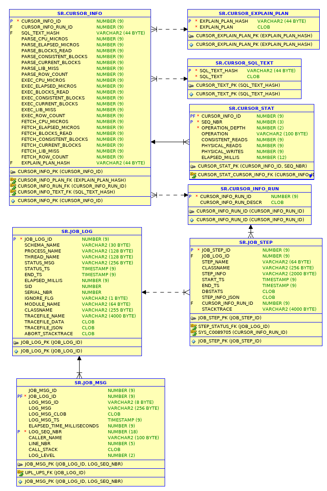

dblogging 2019-10-16
====================

Application instrumentation is essential to performance monitoring,
unfortunately this is often performed by throwing in some logging
statements using a java logging framework or wrapper, such as slf,

This however fails to capture any information essential to end-to-end
monitoring as it omits what is generally the biggest source of latency,
the relational database. What statements are being executed, how long do
they take, which statements take up the bulk of the resources in
aggreggate (an umder-performing statement invoked thousands of times an
hour is not uncommon).

Oracle provides, at great expense, the ASH subystem and even that does
not associated the sql statements to the application code.

This utility provides a simple Application Program Interface to allow
you to record performance information in a simple, low overhead fashion
from any java program or any program that allows pl/sql calls.

Thus a few judicious additions to an Oracle Form or a batch job can
provide the foundation of information necessary to establish where
database resources are being consumed.

Resolution of these matters is a different matter and may involve
gathering statistics, altering execution plans, creating or eliminating
indexes or rewriing SQL.

SGA paramaters may have to be changed.

Document Organization
---------------------

We will introduce the types of logging, show examples of how to
instrument your code and what type of output is generated.

Then we will guide you through the installation and options.

Overview of logging types
-------------------------

Flat file logging
~~~~~~~~~~~~~~~~~

Writes log messages to a text file on the database server.

Includes:

-  log\_seq\_nbr
-  log\_level
-  job\_log\_id
-  log\_msg\_id
-  line\_number
-  current\_timestamp, 'YYYY-MM-DDTHH24:MI:SSXFF'
-  log\_msg
-  caller\_name optional
-  call\_stack optional

This will allow you to easily write log messages from pl/sql in stored
procedures, functions, packages and with most of the flexibility and
ease of using a java logging framework.

.. toctree::
   :maxdepth: 2

   flatFile

Database Logging
~~~~~~~~~~~~~~~~

Record jobs and their steps, how long each step took to execute and
optionally extremely detailed information about every database operation
as an oracle trace file may be parsed and stored in the log repository.

The log repository may be on the same oracle database server, even the
same schema using the same connection as it uses autonomous
transactions, or in postgresql or h2.

.. toctree::
   :maxdepth: 2

   databaseLogging

Oracle trace information
~~~~~~~~~~~~~~~~~~~~~~~~

The third type of logging is an extension of database logging and stores
oracle trace information a relational database.

Oracle tracing is turned on and the trace files parsed and aggregated
and stored in tables associated with the various job steps.

-  oracle
-  h2
-  postgresql

Database logs
-------------

We will start with an example program and show what is logged.

Java Example
~~~~~~~~~~~~

.. code-block:: java

::

    package org.javautil.dblogging;

    import java.sql.Connection;
    import java.sql.SQLException;

    import org.javautil.core.sql.Binds;
    import org.javautil.core.sql.ConnectionUtil;
    import org.javautil.core.sql.SqlStatement;
    import org.javautil.dblogging.logger.Dblogger;
    import org.javautil.util.NameValue;
    import org.slf4j.Logger;
    import org.slf4j.LoggerFactory;

    public class DbloggerForOracleExample {

        private Dblogger dblogger;
        private Connection connection;
        private String processName;
        private boolean testAbort = false;
        private int traceLevel;
        private final Logger logger = LoggerFactory.getLogger(getClass());

        public DbloggerForOracleExample(Connection connection, Dblogger dblogger, String processName, boolean testAbort,
                int traceLevel) {
            this.connection = connection;
            this.dblogger = dblogger;
            this.processName = processName;
            this.testAbort = testAbort;
            this.traceLevel = traceLevel;
        }

        public long process() throws SQLException {
            dblogger.prepareConnection();
            long id = 0;

            try {
                id = dblogger.startJobLogging(processName, getClass().getName(), "ExampleLogging", null, 12);
                logger.debug("============================jobId: {}", id);
                limitedFullJoin();
                fullJoin();
                userTablesCount();
                if (testAbort) {
                    int x = 1 / 0;
                }
                logger.debug("calling endJob");
                dblogger.endJob();
            } catch (Exception e) {
                logger.error(e.getMessage());
                e.printStackTrace();
                dblogger.abortJob(e);
                throw e;
            }
            return id;
        }

        /**
         * This will set the v$session.action
         */
        private void limitedFullJoin() throws SQLException {
            logger.debug("limitedFullJoin =============");
            dblogger.setAction("actionNoStep");
            ConnectionUtil.exhaustQuery(connection, "select * from user_tab_columns, user_tables where rownum < 200");
            dblogger.setAction(null);  // no longer performing that action, so clear 
            logger.debug("limitedFullJoin complete =============");
        }

        private void fullJoin() throws SQLException {
            logger.debug("fullJoinBegins =============");
            // TODO insertStep should set the action 
            dblogger.insertStep("fullJoin", "fullJoin", getClass().getName());
            ConnectionUtil.exhaustQuery(connection, "select * from user_tab_columns, user_tables");
            dblogger.finishStep();
            logger.debug("fullJoin complete =============");
        }

        private void userTablesCount() throws SQLException {
            dblogger.insertStep("count full", "userTablesCount", getClass().getName());
            ConnectionUtil.exhaustQuery(connection, "select count(*) dracula from user_tables");
            dblogger.finishStep();
            // TODO support implicit finish step
        }

        NameValue getJobLog(Connection connection, long id) throws SQLException {
            final String sql = "select * from job_log " + "where job_log_id = :job_stat_id";
            final SqlStatement ss = new SqlStatement(connection, sql);
            Binds binds = new Binds();
            binds.put("job_stat_id", id);
            final NameValue retval = ss.getNameValue();
            ss.close();
            return retval;
        }
    }

Analyzing the logs
~~~~~~~~~~~~~~~~~~

Separate utilities are used to analyzed the logs. A very useful tool is
javautil-condition-identification.

Did any job abort?

What is the trend on elapsed times?

How do elapsed times vary based on time of day?

Getting deeper, with trace information one can drill down to the
details, we will cover that later.

Tracefile generation and persistence
------------------------------------

This utility provides the information to the Oracle Performance
specialist to identify the root cause of the problem, how to repair is
another speciality.

Installation of database artifacts for oracle
=============================================

These files may be found under *src/main/resources/ddl/oracle*

The script that runs them all is *install.sql*

::

    set echo on 
    @prepare_connection.sql
    @my_session_info.sql
    @dblogger_uninstall.sr.sql
    @logger_message_formatter.plsql.sr.sql
    @dblogger_install_tables.sr.sql
    @dblogger_install.pks.sr.sql
    @dblogger_install.pkb.sr.sql
    @logger_persistence.pks.sr.sql
    @logger_persistence.pkb.sr.sql

prepare\_connnection
--------------------

| prepare-connection provides one procedure.
| This will call dbms\_session.clear\_context for each context variable,
restoring the context for a connection returned from a connection\_pool
to the state the of an initially opened connection.

Connection pools do not generally clear this information out as it is
Oracle specific.

my\_session\_info.sql
---------------------

creates the view *my\_session\_info* to allow the connected user to
obtain the v$session record for the current connection.

logger\_message\_formatter
--------------------------

Provides the *logger\_message\_formatter* function, which creates a
single string from all of the logging parameters and makes a call to
dbms\_output.put\_line and then returns the formatted message.

dblogger\_intall\_tables
------------------------

Creates the job and job step tables and views

sequences
^^^^^^^^^

cursor\_info\_run\_id\_seq; cursor\_info\_id\_seq; job\_log\_id\_seq;
job\_msg\_id\_seq; job\_step\_id\_seq;

tables
^^^^^^

-  cursor\_explain\_plan
-  cursor\_sql\_text
-  cursor\_info\_run
-  cursor\_info
-  cursor\_stat
-  job\_log
-  job\_msg
-  job\_step

views
^^^^^

-  cursor\_info\_vw
-  job\_step\_vw
-  job\_log\_vw

Job Logging
-----------

Logging information may be written to a text file, stored in a database
and written to the oracle trace file.

Steps start job logging.
~~~~~~~~~~~~~~~~~~~~~~~~

::

    public long sampleUsage(Dblogger dblogger, Connection appConnection) throws SqlSplitterException, Exception {
        dblogger.prepareConnection();
        final String processName = "Process Name";
        // Start the job

        final long logJobId = dblogger.startJobLogging(processName,getClass().getName(), null, null,  4);
        dblogger.setModule("SplitLoggerTest", "simple example");
        dblogger.setAction("Some work");
        dblogger.insertStep("Full join", "Meaningless busy work", getClass().getName());
        ConnectionUtil.exhaustQuery(appConnection, "select * from user_tab_columns, user_tables where rownum < 100");

        dblogger.setAction("Another set of work");
        ConnectionUtil.exhaustQuery(appConnection, "select count(*) from all_tab_columns");
        // End the job
        dblogger.endJob();
        return logJobId;
    }

job logging persistence has a bit of indirection

Installation
------------

Repositories
~~~~~~~~~~~~

RDBMS persistence support is provided for Oracle, H2 and postgresql

H2 is a lightweight database and may be used to eliminate the need for
support of another Oracle Database.

Postgresql is a high end database that requires minimimal installation
and administration.

You should probable not compound your problem with yet another Oracle
install, but if your DBA will allow you a schema in your database for
logging, you don't have to learn anything else.

The Oracle database could be the same instance as the application being
monitored, but this may raise some objections to the application DBA.

Oracle logging repository
~~~~~~~~~~~~~~~~~~~~~~~~~

If the logging data is to be persisted in Oracle, the tables must be
created and some packages created.

Job log tables
^^^^^^^^^^^^^^

1. job\_log
2. job\_msg
3. job step

| The granularity of job step is left to the invoker.
| As the overhead is very low, there is no reason to be parsimonious
with identification, it's a simple one line call in the user app.

These records can be reviewed for job sucess or failure and form a
historical basis of time elapsed.

This may be used as a starting pointing in locating "what processes are
using the time?"

Additionally they constitute a base performance metric from which
runtime degradation or periodic anomalous runs may be identified.

Data is committed by calls from java to the package logger, provided
here.

The package creates autonomous commits and hence may be safely called
using the same connection as the application.

logging package
~~~~~~~~~~~~~~~

The logger package provides the following:

::

    These primarily set information in the SGA and enable oracle session tracing.

begin\_java\_java

change v$session information
^^^^^^^^^^^^^^^^^^^^^^^^^^^^

procedure prepare\_connection;

set\_module set action

Trace Repository
----------------

Oracle performance tables
^^^^^^^^^^^^^^^^^^^^^^^^^

-  cursor\_explain\_plan
-  cursor\_sql\_text
-  cursor\_info\_run
-  cursor\_info
-  cursor\_stat

logger\_persistence package
---------------------------

The logger persistence package provides an API for writing to various
tables using autonomous transactions.

::

    procedure save_job_log (
        p_job_log_id   in number,
        p_schema_name  in varchar2,
        p_process_name in varchar2,
        p_classname    in varchar2,
        p_module_name  in varchar2,
        p_status_msg   in varchar2,
        p_thread_name  in varchar2,
        p_trace_level  in pls_integer default logger.G_INFO,
        p_tracefile_name in varchar2,
        p_sid          in pls_integer
    );

The source of work is indentifable down to the java thread.

::

    function save_job_step (
        p_job_log_id  in pls_integer, 
        p_step_name   in varchar, 
        p_step_info   in varchar, 
        p_classname   in varchar,     
        p_start_ts    in timestamp,
        p_stacktrace  in varchar

) return number;

::

    procedure finish_step

    procedure end_job(p_elapsed_milliseconds in pls_integer)

    procedure abort_job(p_elapsed_milliseconds in pls_integer,p_stacktrace in varchar);

Install Oracle JDBC
~~~~~~~~~~~~~~~~~~~

`See this
post <https://blogs.oracle.com/dev2dev/get-oracle-jdbc-drivers-and-ucp-from-oracle-maven-repository-without-ides>`__
to use Oracle JDBC properly. Or, you could download the JAR file, and
then execute this command:

TODO the script to locatge
``mvn install:install-file -DgroupId=com.oracle -DartifactId=oracle-jdbc8 -Dversion=12c -Dpackaging=jar -Dfile=<THE_JDBC_JAR_LOCATION>``

Notations in job .sql script used by sqlrunner.

Security in production
======================

User priviliges
===============

Performance
===========

Tools and concepts
==================

User should be familiar with v$ssession view, tkprof command line
utility

Connection Pools
================

After Getting a connection
--------------------------

Contexts
~~~~~~~~

If a session is being used as part of a connection pool and the state of
its contexts are not reinitialized, this can lead to unexpected
behavior.

Packages
~~~~~~~~

Sessions have the ability to alter package state by amending the values
of package variables. If a session is being used as part of a connection
pool and the state of its packages are not reinitialized, this can lead
to unexpected behavior. To solve this, Oracle provides the
dbms\_session.reset\_package procedure.

The dbloggging provided procedure clears all context variables and
resets package state.

Connections must be reset immediately after being obtained from a
connection pool

In src/main/resources/ddl/oracle/prepare\_connection

Convenience Procedure
~~~~~~~~~~~~~~~~~~~~~

::

    CREATE OR REPLACE PROCEDURE prepare_connection
    AS
        context_info DBMS_SESSION.AppCtxTabTyp;
        info_count PLS_INTEGER;
        indx PLS_INTEGER;
    BEGIN
        DBMS_SESSION.LIST_CONTEXT ( context_info, info_count);
        indx := context_info.FIRST; 
        LOOP
            EXIT WHEN indx IS NULL;
            DBMS_SESSION.CLEAR_CONTEXT(
                context_info(indx).namespace,
                context_info(indx).attribute,
                null 
            );
            indx := context_info.NEXT (indx);
        END LOOP;
        DBMS_SESSION.RESET_PACKAGE; 
    END;

create public synonym prepare\_connection for prepare\_connection; grant
execute on prepare\_connection to public; \`\`\`

Zaxxer
~~~~~~

TODO how to call this procedure in the connection pool

## DBMS\_SESSION
----------------

Identifier
----------

SET\_IDENTIFIER and CLEAR\_IDENTIFIER procedures to allow the real user
to be associated with a session, regardless of what database user was
being used for the connection.

Metrics
-------

try {
    String e2eMetrics[] = new
    String[OracleConnection.END\_TO\_END\_STATE\_INDEX\_MAX];
    e2eMetrics[OracleConnection.END\_TO\_END\_ACTION\_INDEX] = null;
    e2eMetrics[OracleConnection.END\_TO\_END\_MODULE\_INDEX] = null;
    e2eMetrics[OracleConnection.END\_TO\_END\_CLIENTID\_INDEX] = null;
    ((OracleConnection) conn).setEndToEndMetrics(e2eMetrics,
    Short.MIN\_VALUE);

} catch (SQLException sqle) {
    // Do something...

}

0 - No trace. Like switching sql\_trace off. 2 - The equivalent of
regular sql\_trace. 4 - The same as 2, but with the addition of bind
variable values. 8 - The same as 2, but with the addition of wait
events. 12 - The same as 2, but with both bind variable values and wait
events.

Monitoring long running
https://oracle-base.com/articles/11g/real-time-sql-monitoring-11gr1

# Database Objects

## Entity Relationship Diagram
   logger\_tables.png

## Table DDL

### Oracle

.. literalinclude:: ../src/main/resources/ddl/oracle/db_logger_install_tables.sr.sql
      :language: sql

References
----------
!![javadoc] ('../target/site/apidocs/index.html') 

https://oracle-base.com/articles/misc/dbms_session

https://oracle-base.com/articles/misc/sql-trace-10046-trcsess-and-tkprof

Spring Developers
=================

Oracle tracing is a powerful tool that logs detailed information about
all calls to the Oracle database.

In order to use this :

-  one must turn on tracing for the current connection
-  set the log file
-  stop tracing
-  call a service to store the trace

-  store the raw trace file
-  analyze the trace file
-  store the analyzed trace file

Overview
~~~~~~~~

Logs messages using utl\_file to a directory on the database server
specified.

First the database directory is created and oracle is granted permission
to read and write it, then the ddl "create directory...." and "grant
read, write on directory..."

Examples
~~~~~~~~

log\_to\_file\_only.proc.sr.sql
^^^^^^^^^^^^^^^^^^^^^^^^^^^^^^^

Input
~~~~~

::

    set serveroutput on
    set echo on
    create or replace procedure log_to_file_only is 
           long_msg clob := 'this is an absurdly long message, ' || 
                    ' interesting stuff to say so I will just write meaningless ' ||
                    ' stuff for a little while. ' ||
                    ' The quick brown fox jumped over the lazy dog. '; 
        
        my_log_file_name varchar(4096); 
    begin
        my_log_file_name := pllogger.open_log_file('log_to_file_only.text');
        pllogger.set_filter_level(9); -- all messages should go to log file
        pllogger.info('anonymous',$$PLSQL_LINE,'begin loop');
        pllogger.info($$PLSQL_UNIT,$$PLSQL_LINE,long_msg); 
        for i in 1..3  
        loop
            pllogger.fine($$PLSQL_UNIT,$$PLSQL_LINE,'i is ' || to_char(i));
        end loop; 
        pllogger.close_log_file();
    exception when others then
            -- a severe condition is not necessarily fatal
        pllogger.severe($$PLSQL_UINIT,$$PLSQL_LINE,sqlerrm);
        pllogger.close_log_file();
        raise;
    end;
    /
    show errors

    exec log_to_file_only();

Output
''''''

::

    "log_level","job_log_id","job_msg_id","line_number","timestamp","log_msg","caller_name","call_stack"
    4,,,17,"2019-10-26T17:19:52.885607","begin loop","anonymous",""
    4,,,18,"2019-10-26T17:19:52.886020","this is an absurdly long message,  exceeding the length of the log_msg field  this should be inserted into the log_msg_clob column.   This message is part of  a unit test of from sample_job_02 of the logging package.   I am running out of  interesting stuff to say so I will just write meaningless  stuff for a little while.  The quick brown fox jumped over the lazy dog. ","LOG_TO_FILE_ONLY",""
    7,,,22,"2019-10-26T17:19:52.886197","i is 1","LOG_TO_FILE_ONLY",""
    7,,,22,"2019-10-26T17:19:52.886357","i is 2","LOG_TO_FILE_ONLY",""
    7,,,22,"2019-10-26T17:19:52.886502","i is 3","LOG_TO_FILE_ONLY",""

TODO
====

Tracing should do the following

-  Begin with any transaction as annotated by @Transactional

Install
=======

::

    cd src/main/resources/ddl/oracle

    sqlplus $ORACLE_UID @ pllogger.pkgs.sr.sql
    sqlplus $ORACLE_UID @ pllogger.pkgb.sr.sql

create directory job\_msg\_dir as
'/common/scratch/ut\_process\_log\_dir'; grant write on directory to sr;

should be granted by user, not by role.

-  Configuring to use your database
-  Example schema

Trace file fields
=================
.. toctree::
   :maxdepth: 2

   traceRecordFields

TODO
====

-  security can't specify file name
-  need an agent to get the log files for remote users
-  TODO escape double quotes in text fields
-  check for anomolous run-times using condition identification
-  plot runtimes
-  TODO describe microservices, multiple connections, tying them all
   together
-  TODO describe using with spring

